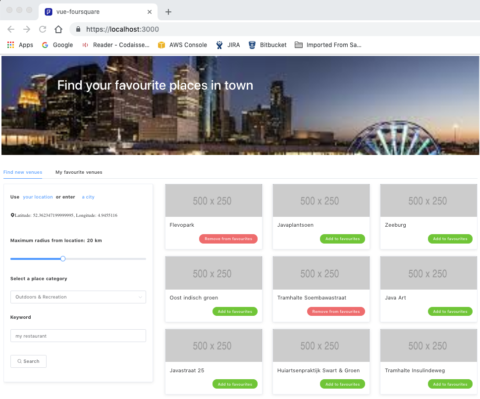

# vue-foursquare

> Vue app using Foursquare APIs and user location

> App live at https://vue-foursquare-gy1r6e0w5.now.sh



## Objective

- Build a web application that uses the Foursquare API (without external API wrapper libraries)

- Get the user location and show a list of available venues

- Allow the user to see more detailed information about a favourite venue

- Give the user the ability to adjust some search parameters (e.g. location, radius, venue types)

## Functionality

### Search for new venues

- Either by using your *current location* (trough `navigator.geolocation.getCurrentPosition`) or
by inputting a *city or location name*

- Define maximum *radius* from location (from 1 to 50 km, 20km is the default)

- Limit the search to a *category*, e.g. "Restaurants" (created dynamically) and/or by inputting a *keyword*

### Save your favourite venues

- Add and remove venues from the search results to your list of favourites

- Select a favourite to see more details of that venue (partially implemented due to restrictions on free Foursquare API accounts)

- Add a note to self to any of your favourites for future reference

## Technical points

- Using Vuex for state management, including getters, mutations and async actions

- Code modularization with separate components and services

- Error management through catchers and event notifications to users

## Out of scope

- Intermediate back-end to wrap Foursquare API calls and avoid exposing keys and secret phrase

- Persisting the data in a database

## Build Setup

``` bash
# Use NODE version 8.10.0

# install dependencies
$ yarn install

# serve with hot reload at localhost:3000
$ yarn run dev

# build for production and launch server
$ yarn run build
$ yarn start

# generate static project
$ yarn run generate
```

For detailed explanation on how things work, checkout [Nuxt.js docs](https://nuxtjs.org).
